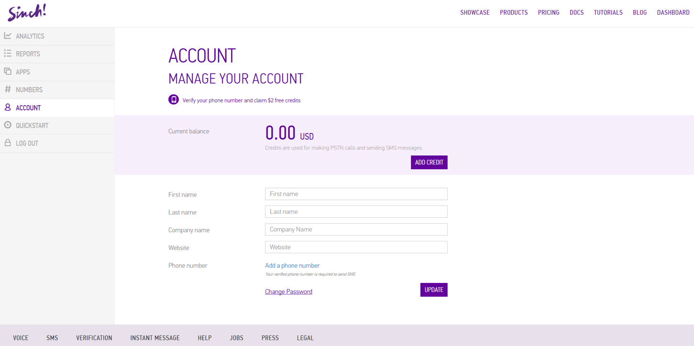
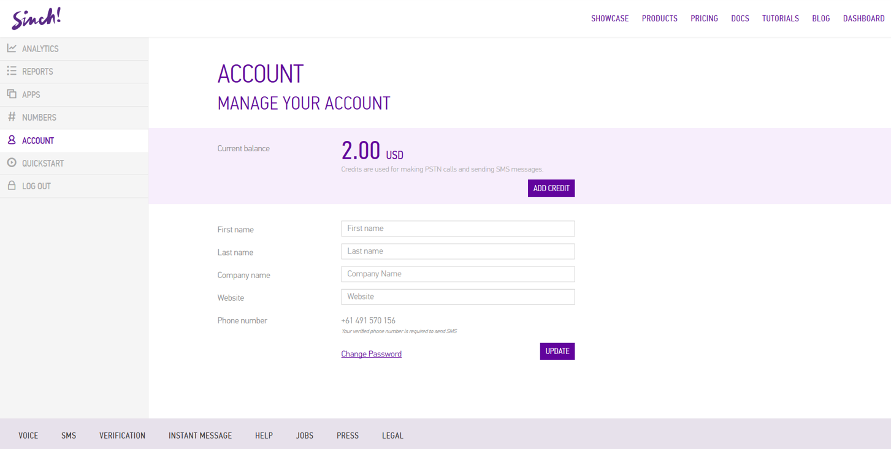
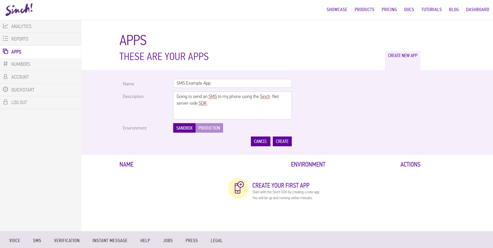
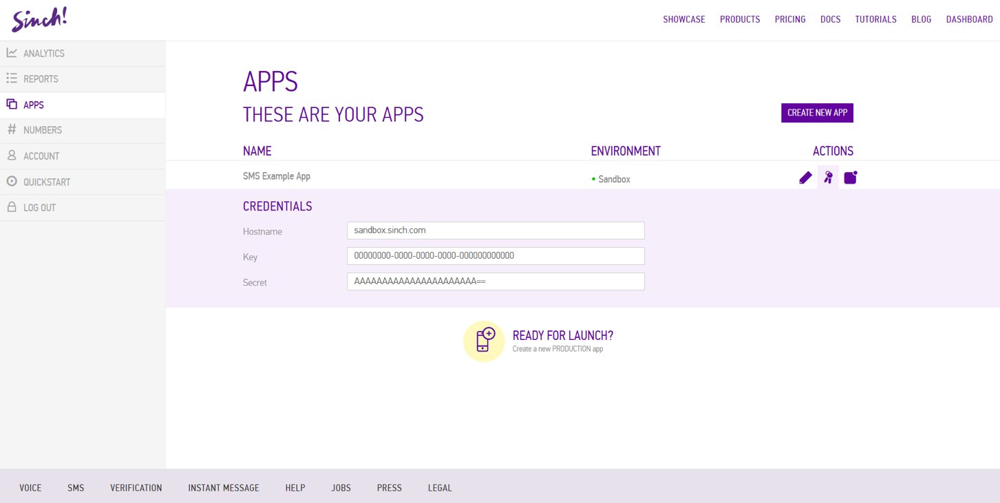

# Send an SMS with the Sinch .Net server-side SDK

Send an SMS with the Sinch .Net server-side SDK
In this example we’ll be creating an application send an SMS.  We’ll be using the sandbox environment, and in the sandbox you can only send to a verified number on your account.  In the Sinch dashboard, ensure you have a phone number on the Account page.  If not, click “Add a phone number”. 



Enter your number and submit the PIN code you will receive in the verification SMS.


You will now have the number attached to your Sinch account, and will also have been credited $2 USD as a bonus for verifying your number.



Create a new application from the “Apps” tab.  Leave the environment to the default: Sandbox.



Click on the key symbols and take note of your application’s key and secret.  These will be used in the Sinch Server SDK shortly.


Open Visual Studio and create a new Console Application:


Right click on References in Solution Explorer and select **“Manage NuGet Packages…”** If you’re using an older version of Visual Studio and don’t see this you will need to add it to your Visual Studio from here: [http://docs.nuget.org/consume/installing-nuget](http://docs.nuget.org/consume/installing-nuget )

Search for `Sinch.ServerSdk` and click **“Install”** for **“Sinch.ServerSdk”**


Because of the limitations of the compiler, having an asynchronous `Main()` method is not allowed.  To overcome this obstacle, and to make for a more straightforward tutorial, create this method:

````csharp
private static async Task MainAsync()
{
}
````

Then add the following line of code to `Main()`:

`MainAsync().GetAwaiter().GetResult();`

Add to following lines to import the SDK namespace:
using `Sinch.ServerSdk;`

To send an SMS, add the following to `MainAsync()`.  Remember to replace the application key and secret with your own, and amend the phone number and message accordingly.

````csharp
var smsApi = SinchFactory.CreateApiFactory("00000000-0000-0000-0000-000000000000", "AAAAAAAAAAAAAAAAAAAAAA==").CreateSmsApi();
var sendSmsResponse = await smsApi.Sms("+61491570156", "Hello world.  Sinch SMS here.").Send();
````

To check the status of an SMS, add the next couple of lines.  It might be worthwhile putting a `Task.Delay()` before checking the status, as it could take a second or two for the SMS to be delivered.  Checking immediately will most likely lead to a status of **“Pending”**.

````csharp
var smsMessageStatusResponse = await smsApi.GetSmsStatus(sendSmsResponse.MessageId);
Console.WriteLine(smsMessageStatusResponse.Status);
Console.ReadLine(); 
````


You’re done.  Download the complete, working example project here. 

Full program code:

````csharp
using System;
using System.Threading.Tasks;
using Sinch.ServerSdk;

namespace Sinch.SendSms.Example
{
    internal class Program
    {
        private static void Main()
        {
            MainAsync().GetAwaiter().GetResult();
        }

        private static async Task MainAsync()
        {
            var smsApi = SinchFactory.CreateApiFactory("00000000-0000-0000-0000-000000000000", "AAAAAAAAAAAAAAAAAAAAAA==").CreateSmsApi();
            var sendSmsResponse = await smsApi.Sms("+61491570156", "Hello world.  Sinch SMS here.").Send();

            await Task.Delay(TimeSpan.FromSeconds(10)); // May take a second or two to be delivered.

            var smsMessageStatusResponse = await smsApi.GetSmsStatus(sendSmsResponse.MessageId);
            Console.WriteLine(smsMessageStatusResponse.Status);
            Console.ReadLine();
        }
    }
}
````
